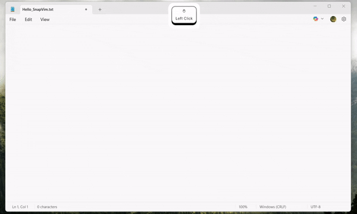

<!-- Banner GIF -->
<p align="center">
  
</p>

<h1 align="center">SnapVim</h1>

<p align="center">
  A lightweight, Windows-only, Vim-inspired text editor designed for quick, short-term edits.
</p>

---

## ✨ Features

- ⚡ **Instant launch with Ctrl+Space** — jump straight into editing from anywhere  
- 🎯 **Vim-inspired commands** — `:w`, `:wq`, `:write` for quick save and exit  
- 📋 **Automatic paste** — after saving, SnapVim pastes the edited text into the last active window  
- 🪶 **Lightweight** — no runtime config persistence, clean and temporary by design  
- 🖥 **Windows platform** — currently only supports Windows

---

## 📖 How It Works

1. **Trigger the editor**  
   Press <kbd>Ctrl</kbd> + <kbd>Space</kbd> anywhere in Windows. SnapVim will launch instantly.

2. **Focus tracking**  
   SnapVim remembers which window was active before it opened.

3. **Edit quickly**  
   Make your changes using normal Vim editing modes.

4. **Save and paste**  
   When you run `:w`, `:wq`, or `:write`, SnapVim automatically:
   - Saves the content  
   - Switches back to the previously active window  
   - Pastes the edited text directly there  

---

## 🛠 Dependencies

SnapVim is built on top of:

- [**libvim**](https://github.com/onivim/libvim) — Core Vim editing engine  
- [**Dear ImGui**](https://github.com/ocornut/imgui) — Immediate Mode GUI for rendering the editor interface  

---

## 📦 Installation & Build

### Prerequisites
- **Clang** ≥ 20.1.8
- **CMake** ≥ 3.21
- Windows development environment (tested on Windows 10+)

### Build Steps
```bash
git clone --recursive https://github.com/yourusername/snapvim.git
cd snapvim
mkdir build && cd build

# Configure with Clang as C and C++ compiler
cmake .. -G "Ninja" -DCMAKE_C_COMPILER=clang -DCMAKE_CXX_COMPILER=clang++

# Build
cmake --build .
```
